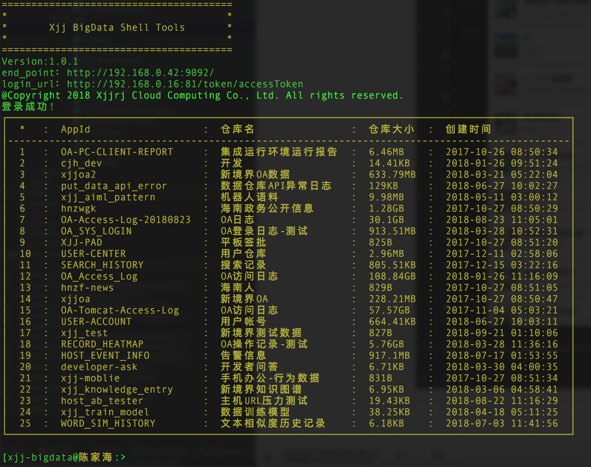
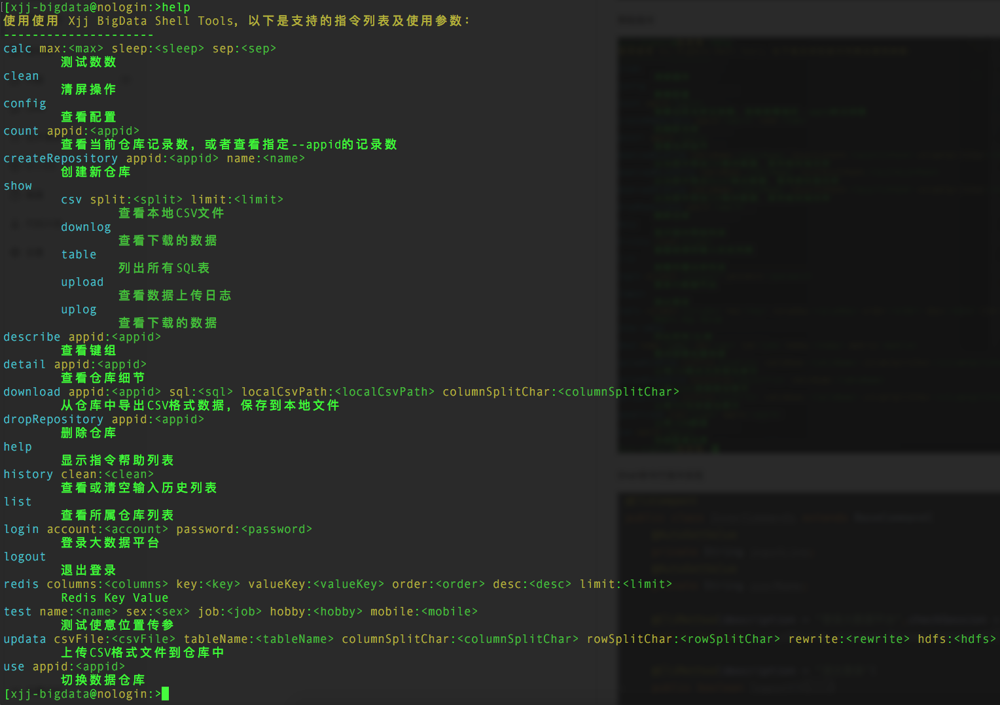

# 说明
    该工具用于快速创建java控制台Application，省去用输入与指令的解析，让开发者把时间放在业务上
    将Java注解式、反射机制编程应用到极致
    原本可以使用Spring Shell实现，前期用Spring Shell开发Xjj BigData Shell Tools到一半时发现，Spring Shell并不能真正适合用于特定命令行指令，
    比如执行一些SQL，用户可能会换行输入、多行输入，并能合并解析到这是条SQL指令
    所以，又重新自主开发了这一套

    通过@CliCompent来设置某个类为Shell Client指令类，工具在运行时会自动扫描到，并通过反射机制映射到运行空间中
    通过@CliMethod来设置某个方法为Shell 指令，同时可以设置在执行该方法前是否要检查登录传话（checkSession=true），默认为true
    通过@AutoSetValue来设置运行时动态注入属性，比如动态注入用户正在输入的行文本

    欢迎各位一起加入和完善更多的功能，让Console App开发更加简便和强大

###代码目录结构
    .
    ├── README.MD
    ├── bin （各平台运行脚本）
    │   ├── startup.bat (Windows平台运行脚本)
    │   ├── startup.sh  (linux或Mac平台运行脚本)
    ├── conf
    │   ├── config.properties (工具配置文件)
    ├── pom.xml (maven配置)
    ├── src (源码)
    │   ├── main
    │   ├── test
    ├── xjj-bigdata-tool.iml (IDEA项目工程)

### 快速获取Cli Tools Template项目，编译运行

    git clone http://192.168.0.66/cjh/cli-tools-template.git
    cd cli-tools-template
    mvn package
    cd ./bin/
    ./startup.sh

### 配置自动登录到大数据平台
    cd cli-tools-template/conf
    vim ./config.properties

    修改account和password为自己OA帐号
    通过修改配置shell_commands_package让工具自动扫描加载映射@CliCompent和@CliMethod指令

### 相关运行截图，基于该模板开发的Xjj BigData Shell Tools
    启动界面
    

    帮助指令
    

    Shell命令行指令实现
    
